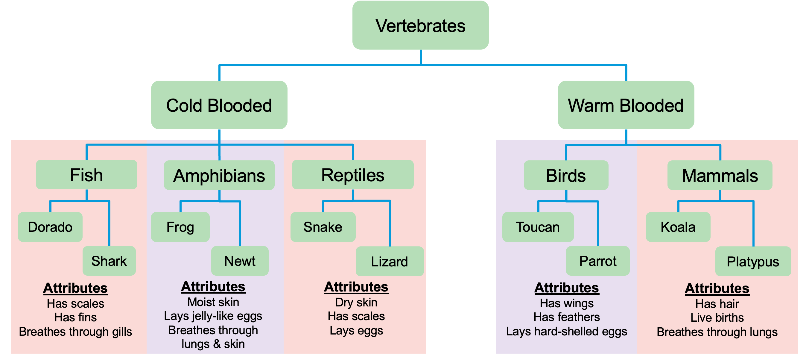

# Import is Important Tutorial
## Lab: Animal Classification System

### Learning Objectives
By the end of this lab, you will be able to:
- Create a multi-level package structure using directories and `__init__.py` files
- Understand the difference between modules (`.py` files) and packages (directories with `__init__.py`)
- Use relative imports to share code between modules in the same package
- Control namespace visibility using `__init__.py` files
- Import modules and attributes using various import syntaxes
- Understand how Python's import system affects attribute access

<!-- ## Deliverables

When you complete this lab, you will have:

1. **A complete package structure** that:
   - Organizes animals hierarchically by classification
   - Uses `__init__.py` files to make directories into packages
   - Allows imports at different levels of the hierarchy

2. **6-10 animal modules** (2 per classification):
   - Fish, Amphibians, Reptiles, Birds, Mammals
   - Each with unique attributes appropriate to that species

3. **Shared attributes for each classification** that:
   - Are accessible to all animals in that classification
   - Can be accessed at the package level
   - Reflect the biological characteristics of that group

4. **Stretch Goal: A working main.py** that demonstrates:
   - Importing packages with aliases
   - Accessing shared attributes at the package level
   - Accessing individual animals and their attributes
   - Multiple import styles and their trade-offs

5. **Understanding of key concepts** including:
   - The difference between modules and packages
   - How `__init__.py` controls namespace visibility
   - When to use relative vs. absolute imports
   - Trade-offs between different import styles -->

### Setup Instructions

1. Follow these [setup instructions](./setup.md), then return here to get started
1. Navigate to the new `animal-classification` directory in your terminal
1. You'll build your entire package structure from scratch in this directory

### Overview
In this lab, you'll create a package structure that models the biological classification of vertebrate animals. You'll organize animals into a hierarchy that mirrors taxonomic relationships, and learn how Python's import system allows you to access attributes and modules at different levels of the hierarchy.

### Lab Structure

You'll create a package hierarchy that mirrors the biological classification of vertebrates, which are animals with backbones. The structure, as shown in the following diagram, organizes vertebrates by their characteristics (warm-blooded vs. cold-blooded) and then by their specific classification (fish, mammals, birds, etc.).

**Your Goal:** Design and implement a package structure where:
- Each level of classification is represented by a package (directory with `__init__.py`)
- Individual animals are modules (`.py` files)
- Shared characteristics for each classification are stored in a way that all animals in that group can access them
- You can import animals and their attributes at different levels of the hierarchy

You'll also create a `main.py` file at the root of your workspace to test your package structure.

If you're ready, go to the first part of the lab using the navigation below!

---

Next Up: [Part 1: Understanding Packages vs. Modules](lab_spec/01_part1.md)